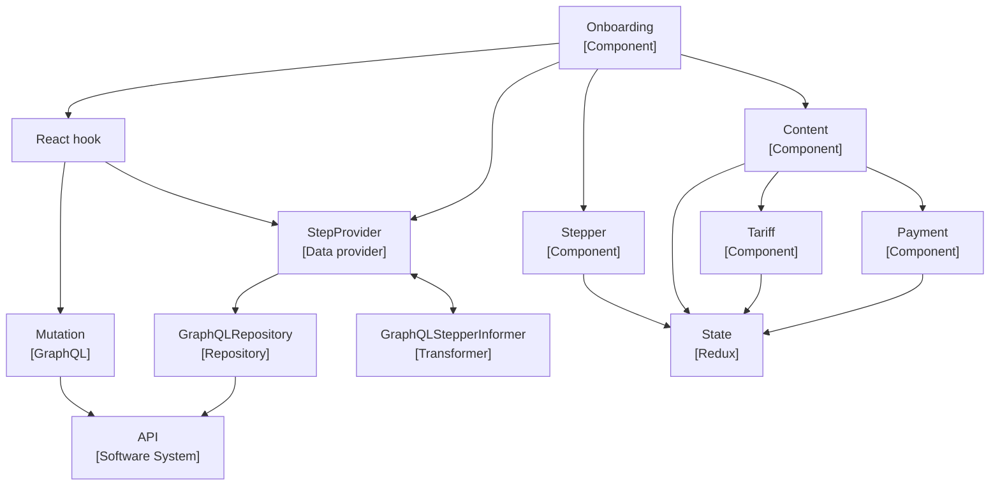
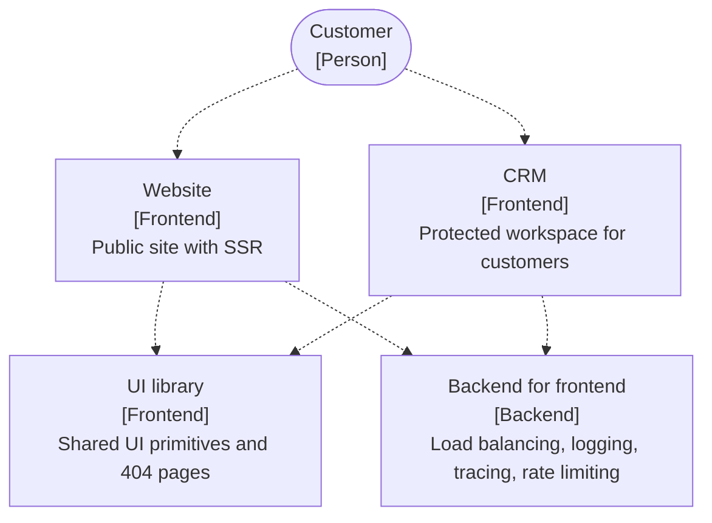
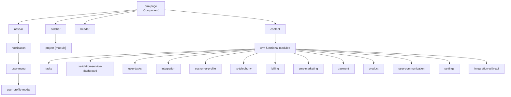
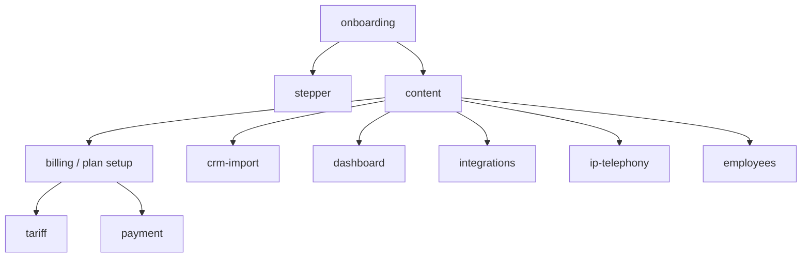
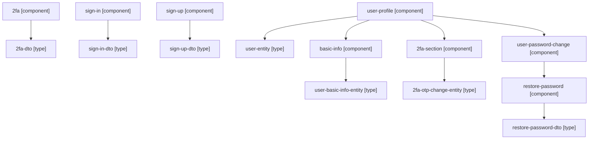
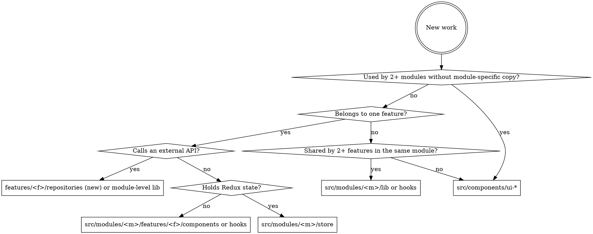

# Architecture

VilnaCRM is a multi-frontend, microservice-backed CRM. This skill captures the
**frontend** architecture: what modules exist, how a feature is layered, and
which boundaries are enforced as `dependency-cruiser` errors.

## Layered Architecture (the one diagram to internalize)

Every feature follows the same Component → Hook → Repository → API flow,
illustrated by the onboarding feature:



Read the layers top to bottom:

1. **Components** (`features/<feature>/components/`) — presentation only.
   They consume hooks and render children; they never import repositories,
   the module store, or `src/services/` directly.
2. **Hooks** (`features/<feature>/hooks/use-*.ts`) — UI logic, Redux state
   access, and the only place that calls repository APIs and dispatches
   mutations.
3. **Data providers / transformers** — adapt repository output to the shape
   the UI needs. Live next to the repository they wrap.
4. **Repositories** (`features/<feature>/repositories/`) — the only layer
   allowed to talk to `src/services/https-client/`. Exposed through their
   `index` file; internal files are private.
5. **API gateway / microservices** — see the backend list below.

## Boundary Rules (dependency-cruiser, severity `error`)

These come from `.dependency-cruiser.js`. They run on every PR via
`make lint-deps`. Internalize them before placing a file.

**Module and feature isolation:**

- `no-cross-module-imports` — one module importing another module's
  internals.
- `no-cross-feature-imports` — sibling features in the same module
  importing each other. Use the module's shared `hooks/`, `lib/`,
  `store/`, `types/`, or `utils/`.
- `no-components-import-modules` — `src/components/*` depending on any
  `src/modules/*`.

**Public API contract (issue #107):**

- `no-module-internal-imports` — code outside a module reaching a
  `src/modules/<m>/*` file other than the module `index` barrel. Enter
  through `@/modules/<m>`. Exceptions: the DI composition root and the
  app-shell router's code-split route/guard entries.
- `no-feature-internal-imports` — module-level `store` / `types` / `lib` /
  `hooks` / `utils` / `config` reaching a feature's internals instead of its
  `index` barrel (e.g. `@auth`). Sibling features go through
  `no-cross-feature-imports`.

**Repository boundary:**

- `no-repository-internal-imports` — reaching past a repository's `index`
  file.
- `no-repositories-to-ui-hooks` — repositories depending on feature
  `components/`, `hooks/`, `routes/`, or module `hooks/` / `store/`.
- `no-feature-direct-http-client` — anything outside `repositories/`
  importing `src/services/https-client/`.
- `no-store-direct-http-client` — module `store/` importing
  `src/services/https-client/`.

**UI layering:**

- `no-feature-ui-to-services` — feature `components/`, `hooks/`,
  `routes/` importing `src/services/`.
- `no-components-to-repositories` — components importing repositories
  directly (go through a hook).
- `no-components-to-store` — components importing the module store
  directly. Exception: hook files (`use-*.ts`).
- `no-store-to-feature-ui` — module store importing feature
  `components/`, `hooks/`, `routes/`.
- `no-lib-to-features` — module `lib/` depending on its own `features/`.

**DI containment:**

- `no-tsyringe-outside-di-and-repositories` — `tsyringe` imports outside
  composition root, repositories, services, stores, error utils, and
  module store mappers.
- `no-di-config-import-outside-composition-root` — importing
  `src/config/dependency-injection-config.ts` outside `src/index.tsx`,
  `src/app.tsx`, `src/stores/`, or `src/modules/*/store/*-slice.ts`.

**Folder shape:**

- `module-allowed-folders` — module root may only contain `config`,
  `features`, `hooks`, `lib`, `store`, `types`, `utils`.
- `feature-allowed-folders` — feature root may only contain `assets`,
  `components`, `hooks`, `i18n`, `repositories`, `routes`, `types`,
  `utils`.
- `feature-hooks-file-convention` — files inside `features/*/hooks/`
  must be `index.*` or `use-<kebab>.*`.

**Naming:**

- `no-uppercase-paths`, `src-module-name-kebab-case`,
  `src-feature-name-kebab-case` — no uppercase letters in any source or
  test path.

When `make lint-deps` reports a violation, the fix is almost always to
introduce or use the missing layer (a hook, a repository public re-export),
never to silence the rule.

## Frontend System Context

VilnaCRM ships three frontend products plus a shared library, all behind a
backend-for-frontend (BFF):



This repository is the **CRM frontend**. Shared UI lives in `src/components/`
under the `ui-` prefix (`ui-button/index.tsx` exporting `UIButton`).

## Frontend Module Catalog

Every box below is — or will be — a directory under `src/modules/<kebab>/`.
Names are lowercase kebab-case (enforced by `src-module-name-kebab-case`).

```mermaid
flowchart TD
  uiLibrary["ui-library<br/>(src/components/ui-*)"]

  uiLibrary -.-> user["user<br/>auth, registration, 2FA, profile"]
  uiLibrary -.-> core["core<br/>sidebar, navbar, footer, user menu"]
  uiLibrary -.-> notification["notification"]
  uiLibrary -.-> orders["orders"]
  uiLibrary -.-> integrations["integrations"]
  uiLibrary -.-> ipTelephony["ip-telephony"]
  uiLibrary -.-> userTask["user-task"]
  uiLibrary -.-> search["search"]
  uiLibrary -.-> crmImport["crm-import"]
  uiLibrary -.-> project["project"]
  uiLibrary -.-> payment["payment"]
  uiLibrary -.-> analytics["analytics"]
  uiLibrary -.-> webhook["webhook"]
  uiLibrary -.-> configs["configs"]
  uiLibrary -.-> employees["employees"]
  uiLibrary -.-> dashboards["dashboards"]
  uiLibrary -.-> tariff["tariff"]
  uiLibrary -.-> userOnboarding["user-onboarding"]
  uiLibrary -.-> employment["employment"]
  uiLibrary -.-> product["product"]
  uiLibrary -.-> featureToggle["feature-toggle"]

  dashboards --> salesmanBoard["salesman-board"]
  dashboards --> managementBoard["management-board"]
  project --> crud["crud"]
  product --> crud
  crud --> order["order"]
```



Module composition (`dashboards → salesman-board`, `product → crud`,
`crud → order`) is the only place sub-module imports are allowed. Everything
else must go through `src/modules/<m>/lib/`, `store/`, `types/`, or `utils/`,
or through the public exports of another module — never a deep import.

## Backend Microservices (what repositories call)

The frontend never talks to a microservice directly. It calls the BFF / API
gateway, and the repository layer hides which service answered.

- **user-service** (PHP, API Platform) — auth, registration, 2FA, OAuth,
  profile, password reset.
- **payment-service** (PHP, API Platform) — plans, invoices, payment
  provider configs, payment page.
- **core-service** (PHP, API Platform) — products, contacts, projects,
  attributes, tasks, dashboards, search, IP telephony settings,
  integrations.
- **notification-service** (Golang) — SSE notifications, emails,
  alerting.
- **webhook-service** (Golang) — inbound and outbound webhooks; webhook
  settings per project.
- **analytics-service** (Golang) — analytics collection, dashboards,
  alerting workers.

Each backend has its own database (MariaDB / MongoDB / MemoryDB / Vertica),
cache, and file storage. Those are implementation details the frontend must
not encode — call the BFF and let the service decide.

## CRM Page Composition

`/crm` is composed top-down from `core` module primitives plus feature
modules mounted into `content`:



The `core` module owns navbar, sidebar, header, footer, and user menu
chrome. Feature modules mount under `content` via the router.

## Onboarding Page Composition



`user-onboarding` orchestrates the flow; each step is a feature module
already documented in the catalog. The layered-architecture diagram at the
top of this skill shows the internal data flow.

## User Module — Auth and Profile Composition



Each component pairs with a typed DTO in `types/`. The DTO is the shape the
repository returns; the component never sees the raw API response.

## Placement Decision



When the placement is non-obvious, stop and re-read the boundary table —
the violation is usually telling you the layer you skipped.

## Verification

```bash
make lint-deps
```

Runs `dependency-cruiser`. Treat any error as the architecture telling you
something is in the wrong layer. Fix the import path or move the file;
never weaken `.dependency-cruiser.js`.

For broader checks before commit:

```bash
make format
make lint
```

## Related Skills

- [code-organization](../code-organization/SKILL.md) — kebab-case naming,
  module / feature folder lists, file placement.
- [frontend-component-development](../frontend-component-development/SKILL.md)
  — how to build the component and hook layers.
- [observability-instrumentation](../observability-instrumentation/SKILL.md)
  — where to add Sentry, structured logs, and web-vitals along the layered
  flow.
- [code-review](../code-review/SKILL.md) — what to flag when a PR crosses an
  architectural boundary.

## Common Mistakes

- `no-feature-direct-http-client` fires — a component or hook is calling
  `https-client` itself. Move the call into a repository and consume it
  through a hook.
- `no-components-to-store` fires on a `.tsx` — a component is importing
  the slice directly. Expose state through a `use-*.ts` selector hook and
  import that.
- `no-cross-feature-imports` fires — one feature reaches into a sibling
  feature's `components/` or `hooks/`. Promote the shared code to
  `src/modules/<m>/lib/` or `hooks/`.
- `feature-hooks-file-convention` fires — a non-hook file (helper, types)
  was placed inside `hooks/`. Move it to `utils/`, `types/`, or `lib/`.
- `module-allowed-folders` fires on `helpers/` — old layout still in use.
  Rename to `lib/` (or `utils/` at feature level).
- A repository imports from `hooks/` or `components/` — mapping logic
  crept into the wrong layer. Move the mapping into the repository or a
  dedicated transformer.
- Need to share state across modules — wrong layer. Modules are isolated
  by design; lift to `src/stores/` or expose a hook from the owning
  module.
