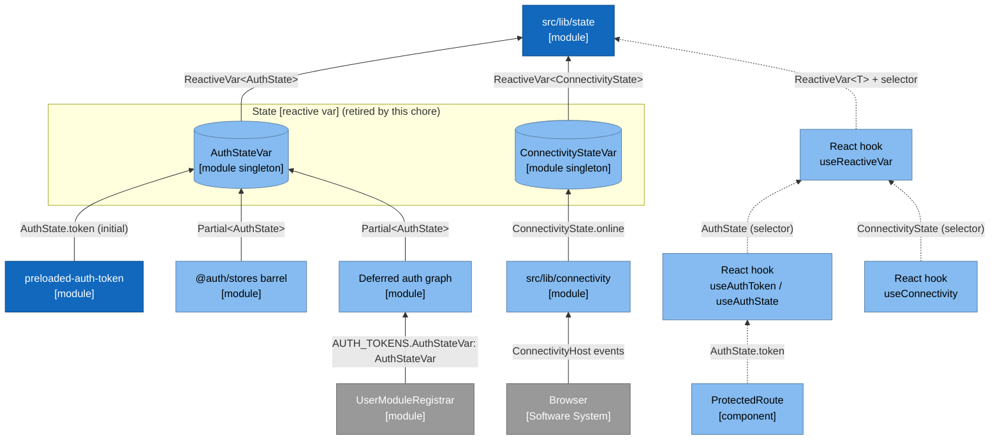
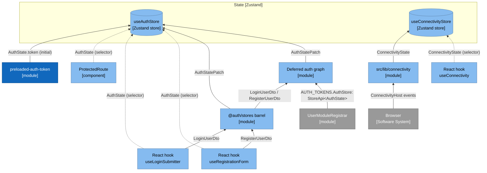
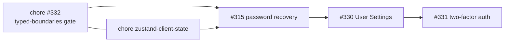

# Architecture: Zustand for client state (chore)

**Author:** BMad (Architect) **Date:** 2026-10-08 **Feature:** `zustand-client-state`

The [PRD](./prd-zustand-client-state-2026-10-08.md) decides _what_; this document decides _how_.

## 1. Approach

A one-for-one swap of the container. Each `*Var` becomes a Zustand store created with `create`
and no middleware; each `useReactiveVar(var, select)` becomes `useStore(select)`; each
`var.set(patch)` becomes `store.setState(patch)`. Stores live in `use-*.ts` hook files, which
the class rules (#100, #129) and the DI-collaborator gate (#130) already exempt. Nothing else
moves: the writers, the DI graph, the deferred chunk and the seed stay where they are.

## 2. Before and after

The board's `State [Redux]` role is drawn `State [Zustand]` (shared contract §5). Every edge
names the type it carries.

### 2.1 Before (today, ADR-008)



### 2.2 After (this chore)



The barrel is `@auth/stores/index.ts` (`DeferredAuthActions`, exported as `authActions`); the
deferred auth graph is the lazily imported DI container plus `AuthStoreActions`. Neither is
drawn as an actions stereotype: both exist today and only change how they write.

## 3. Store shapes

### 3.1 Auth store

```ts
// src/modules/user/features/auth/stores/use-auth-store.ts
import { create } from 'zustand';

import preloadedAuthTokenSeed from '@/config/env/preloaded-auth-token';
import type { AuthState } from '@auth/types/auth-store';

export const CLEARED_AUTH_STATE: AuthState = {
  email: '',
  token: null,
  user: null,
  loginLoading: false,
  loginError: null,
  registerLoading: false,
  registerError: null,
};

const useAuthStore = create<AuthState>()(() => ({
  ...CLEARED_AUTH_STATE,
  token: preloadedAuthTokenSeed.read(),
}));

export default useAuthStore;
```

- `AuthState` is unchanged. `AuthStatePatch = Partial<AuthState>` sits beside it in
  `@auth/types/auth-store.ts` (added here, or already there from #332).
- **Reads.** `useAuthToken` returns `useAuthStore((s) => authStoreSelectors.token(s))`, so it
  re-renders only on a token change; the selector is called on the singleton, never detached.
  `useAuthState` returns `useAuthStore()`. Selectors return a field or the stable state object,
  never a fresh object, so Zustand v5 needs no `useShallow`.
- **Writes.** Zustand's `setState(patch)` merges shallowly, as `AuthStateVar.set` did:

| Today                              | After                                                    |
| ---------------------------------- | -------------------------------------------------------- |
| `AuthStateVar.set(patch)`          | `useAuthStore.setState(patch)`                           |
| `AuthStateVar.reset()`             | `useAuthStore.setState(CLEARED_AUTH_STATE)`              |
| `AuthStateVar.resetRegistration()` | `setState({ user: null, registerError: null, … })`       |
| `AuthStateVar.clearLoginError()`   | `useAuthStore.setState({ loginError: null })`            |
| `this.deps.authState.set(patch)`   | `this.deps.authState.setState(patch)`                    |
| `AUTH_TOKENS.AuthStateVar`         | `AUTH_TOKENS.AuthStore`, `useValue: useAuthStore`        |
| `AuthStoreActionsDeps.authState`   | typed `StoreApi<AuthState>` (`import type` from zustand) |

`@auth/stores/index.ts` exports `useAuthStore` in place of `AuthStateVar`. The DI registration
reuses the existing `registerAuthState` method, so `UserModuleRegistrar` gains no closure.

### 3.2 Connectivity store

```ts
// src/lib/connectivity/use-connectivity-store.ts
import { create } from 'zustand';

import type { ConnectivityState } from './types/connectivity-state';

const useConnectivityStore = create<ConnectivityState>()(() => ({ online: true }));

export default useConnectivityStore;
```

`BrowserConnectivityAdapter` takes `StoreApi<ConnectivityState>` and its `sync` writes
`this.connectivity.setState({ online: host.navigator.onLine })`. `src/index.tsx` passes
`useConnectivityStore`. `ConnectivityStateVar.setOnline`'s equality guard is dropped: a write of
the same flag re-runs the `online` selector, which returns the same boolean, so nothing renders.

### 3.3 Behaviour parity

- Both primitives compare with `Object.is` and both create a new object on every merge write,
  so subscribers are notified exactly as before.
- `ReactiveVarState.safeNotify` caught a throwing listener; Zustand does not. The only
  listeners are React's `useSyncExternalStore` callbacks, which do not throw.
- The token stays memory-only: no `persist`, so a reload clears it (ADR-008 session contract).

## 4. The seed and the DCE invariants

`preloaded-auth-token.ts` is not touched. The store calls `preloadedAuthTokenSeed.read()` once,
inside its initializer, exactly where `AuthStateVar`'s constructor called it. The guard and both
reads stay in that one method, and `use-auth-store.ts` names neither the window key nor the
token variable, so CLAUDE.md invariants 1 to 3 hold. Proof:
`tests/unit/tooling/preloaded-auth-seed-gate.test.ts` unchanged and green, and CI's
`make check-auth-seed-gate` scanning the production bundle.

## 5. Gates

### 5.1 ESLint

- `clientStateSelectors` loses its first entry (the `zustand` import ban). The three
  `useSyncExternalStore` entries stay in every `src` block; their messages now read "Read client
  state through a Zustand store hook (ADR-023)". No file is exempt: Zustand calls
  `useSyncExternalStore` inside `node_modules`, which ESLint never lints.
- The `files: ['src/lib/state/use-reactive-var.ts']` block is deleted with the file.

### 5.2 Fixtures and the policy pin

- `scripts/ci/eslint-gate-fixtures.mjs`: delete `S.zustandImport` and its three must-fail
  fixtures (`zustand-import-component`, `zustand-dynamic-import-logic`,
  `zustand-subpath-import-hook`); delete the `stateBridgeSite` probe and
  `use-sync-external-store-bridge-site-exempt`; add one must-pass control,
  `zustand-create-hook-allowed`, on the `hook` probe. The rot guard still sees one fixture per
  live selector.
- `tests/unit/config/eslint-policy.test.ts` (the issue-#110 case): on the component, logic and
  hook files, the Zustand selector is absent and the `useSyncExternalStore` selector present.

### 5.3 Contract test

`tests/unit/tooling/state-architecture-contract.test.ts` is rewritten for ADR-023:

- `zustand` is in `dependencies` (not dev) and in `bun.lock`;
- `src/lib/state`, `auth-var.ts` and `connectivity-state-var.ts` do not exist, and no `src/`
  file names `ReactiveVarFactory`, `useReactiveVar`, `AuthStateVar` or `ConnectivityStateVar`;
- no `src/` file contains `useSyncExternalStore`;
- `zustand` is imported only from the root specifier, so `persist`, `devtools` and the other
  subpaths cannot appear;
- the two store files call `create<AuthState>()` and `create<ConnectivityState>()`;
- ADR-023 is `Approved`, ADR-008 is `Superseded` and links ADR-023, ADR-002 stays
  `Superseded`, and the index lists ADR-023;
- ADR-023 and the guide define the three categories and name the two dependency-cruiser rules;
- the contributor guides name `useAuthStore`, none names `useReactiveVar` or `AuthStateVar`, and
  `.claude/react-sdlc.yml` reads `state: zustand`.

### 5.4 DI-collaborator and class-naming policies

- `config/di-collaborator-policy.js`: the `auth-var.ts` render-path entry is deleted (the new
  store is a hook file, exempt by pattern). `tests/unit/tooling/di-collaborator-gate.test.ts`
  swaps `@auth/stores/auth-var` for `@auth/stores/use-auth-store` in its forbidden list, so a
  gated class that value-imports the store still fails.
- `config/class-naming-policy.js` drops `*Var` and `*State`; no class uses them afterwards, and
  a reactive-var class can no longer be named. The CLAUDE.md and Copilot tables follow, which
  `class-naming-gate.test.ts` checks.

## 6. Tests

- **Reset helper.** `tests/utils/reset-client-stores.ts`:

  ```ts
  export function resetClientStores(): void {
    useAuthStore.setState(useAuthStore.getInitialState(), true);
    useConnectivityStore.setState(useConnectivityStore.getInitialState(), true);
  }
  ```

  Each test that writes a store calls it in `beforeEach`, replacing `authStateVar.reset()` and
  `connectivityStateVar.setOnline(true)`. It is not wired into a global setup file: a setup
  import would load the store modules before tests that isolate them.

- **Replaced tests.** The eight tests of retired code go. New: `use-auth-store.test.ts` (cleared
  shape, seeded token, no-`window` seed), `use-auth-store.integration.test.ts` (keeps the
  integration suite's 100 % `src` coverage) and `use-connectivity-store.test.ts`.
- **Mutation.** The store initializers run at import. Their tests load the module with
  `tests/unit/utils/isolated-module.ts`, so the literal is evaluated inside the test and a
  mutant is `Killed`, not `Survived` with zero tests (CLAUDE.md, "Static values need loading
  inside the test"). No `Stryker disable` is added.
- **Console gate.** Nothing new logs.

## 7. Budget

- **Measured on the package.** `zustand@5.0.15` `esm/react.mjs` is 739 B raw (351 B gzip) and
  `esm/vanilla.mjs` 1,001 B (417 B gzip), before minification. React is already eager.
- **Removed.** `ReactiveVarFactory`, `ReactiveVarState` and `useReactiveVar`, about 2 kB of
  source, a few hundred bytes minified.
- **Expected delta.** Below 1 kB raw and 0.5 kB gzip on the eager entrypoint, which was about
  430 kB raw of the 470 kB budget at PR #307 (2026-09-29).
- **Measurement.** Before and after come from the `bundle size` workflow's sticky comment (base
  vs head, per entrypoint, gzip) and the Rspack raw hint in the production build; both numbers go
  in the PR body. A breach is fixed at the source.

## 8. ADR-023 and documentation

- **ADR-023** (`docs/adr/023-zustand-client-state.md`): 018 to 022 are claimed by PR #311, #315,
  #331, #330 and #332. Status `Approved`, Deciders `[@kravalg](https://github.com/kravalg)`.
  - Context: the user's decision, the history (#44, #46, #42, #279) and Apollo as the real
    paint-path cause.
  - Options: Zustand `create` without middleware (chosen); keep the reactive var; Zustand
    vanilla `createStore` with a hand-written bridge.
  - Outcome: the three categories, the store shape, the DI token, and the server-state and
    session-token rules carried forward from ADR-008.
- **ADR-008:** status `Superseded`, plus a link to ADR-023. ADR-002 is not edited.
- **Docs:** `docs/adr/README.md` (row), `docs/state-architecture.md` (client and session
  sections, the Zustand example, the reset helper, the "What fails CI" table), `CLAUDE.md`
  (tech stack, module tree, auth-state pattern, #100 note, naming table, #130 render-path list,
  pattern 15, the `no-invariant-returns` rationale), `AGENTS.md` (store pattern section and
  mentions), `.github/copilot-instructions.md`, `.claude/skills/AI-AGENT-GUIDE.md`,
  `.claude/react-sdlc.yml` (`state: zustand`).
- **ADR drift:** the `package.json` dependency change is a significant path; ADR-023 in the same
  PR satisfies `make check-adr-drift`.

## 9. Landing order



The two chores are independent; the second to land rebases (PRD §5). If #332 is first, this
chore also deletes #332's TB-1 spread in the `use-reactive-var.ts` block, the fixtures on the
`stateBridgeSite` probe and the pin row for that block; its new code (`StoreApi<AuthState>`,
`AuthStatePatch`, `ConnectivityState`) already satisfies TB-1. If this chore is first, #332 drops
that block from its wiring list, probes, pin and burn-down.

## 10. Files

| Area    | New | Modify | Delete | Story    |
| ------- | --- | ------ | ------ | -------- |
| `src/`  | 2   | 12     | 6      | 1.2      |
| tests   | 4   | 26     | 8      | 1.1–1.3  |
| tooling | 0   | 6      | 0      | 1.1–1.3  |
| docs    | 1   | 8      | 0      | 1.1, 1.3 |

- **`src/` new:** the two stores. **Modify:** `use-auth-state.ts`, `use-auth-token.ts`,
  `stores/index.ts`, `auth-store-actions.ts`, `types/auth-store-actions-deps.ts`,
  `types/auth-store.ts`, `config/di.ts`, `config/tokens.ts`, `browser-connectivity-adapter.ts`,
  `hooks/use-connectivity.ts`, `src/index.tsx`, `ui-form.stories.tsx`. **Delete:** the four
  `src/lib/state/` files, `auth-var.ts`, `connectivity-state-var.ts`.
- **Tests new:** three store tests and `tests/utils/reset-client-stores.ts`. **Modify:** the 25
  tests that use the retired names, and `eslint-policy.test.ts`. **Delete:** the eight tests of
  retired code.
- **Tooling:** `package.json`, `bun.lock`, `eslint.config.mjs`,
  `scripts/ci/eslint-gate-fixtures.mjs`, `config/di-collaborator-policy.js`,
  `config/class-naming-policy.js`.
- **Docs:** ADR-023 new; ADR-008, `docs/adr/README.md`, `docs/state-architecture.md`,
  `CLAUDE.md`, `AGENTS.md`, `.github/copilot-instructions.md`, `.claude/skills/AI-AGENT-GUIDE.md`,
  `.claude/react-sdlc.yml`.

About 73 files in all; most test edits swap `authStateVar.reset()` for `resetClientStores()`.

## 11. Gate compliance

- **Metrics and jscpd:** the stores are smaller than the classes they replace; no function grows.
- **Mutation:** fewer mutants (the reactive-var primitive goes); the new initializers are covered
  as §6 says; `break` stays 100.
- **Visual and a11y:** no rendered output changes.
- **Ratchet (#188):** no guarded value moves.

## 12. Traceability

| PRD     | Section   | Story    |
| ------- | --------- | -------- |
| FR-1    | §7        | 1.2      |
| FR-2–6  | §3        | 1.2      |
| FR-7    | §5.4, §10 | 1.2      |
| FR-8    | §4        | 1.2      |
| FR-9    | §6        | 1.2      |
| FR-10   | §5        | 1.1–1.3  |
| FR-11   | §8        | 1.1, 1.3 |
| NFR-1–5 | §3.3–§7   | 1.2      |
