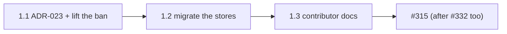

# Epics and stories: Zustand for client state (chore)

**Author:** BMad (Product Manager) **Date:** 2026-10-08 **Feature:** `zustand-client-state`

## Overview

One epic, three stories, from the [PRD](./prd-zustand-client-state-2026-10-08.md) (FR-1 to
FR-11, NFR-1 to NFR-5) and the [architecture](./architecture-zustand-client-state-2026-10-08.md)
(`§n`). The stories land in one pull request, in order. The docs come last because the contract
test pins the guides to the code they describe; written first, they would turn the suite red
until the migration landed.

**Definition of done.** Four rules, for every story:

1. No threshold, budget, allowlist or glob is edited to pass.
2. No `eslint-disable`, `Stryker disable`, cast, `!`, `@ts-expect-error` or `any`.
3. Local gates are `make format`, ESLint, Prettier and `tsc` on the changed files and the focused
   Jest files a story names.
4. The full `make lint`, every suite and the bundle and Lighthouse budgets run in CI only.

### FR coverage map

| Requirement | Stories       |
| ----------- | ------------- |
| FR-1        | 1.2           |
| FR-2        | 1.2           |
| FR-3        | 1.2           |
| FR-4        | 1.2           |
| FR-5        | 1.2           |
| FR-6        | 1.2           |
| FR-7        | 1.2           |
| FR-8        | 1.2           |
| FR-9        | 1.2, 1.3      |
| FR-10       | 1.1, 1.2, 1.3 |
| FR-11       | 1.1, 1.3      |
| NFR-1       | 1.2           |
| NFR-2       | 1.2           |
| NFR-3       | 1.2           |
| NFR-4       | 1.1, 1.2, 1.3 |
| NFR-5       | 1.2           |

## Epic 1: Zustand is the client-state primitive

**Goal.** Replace the reactive var with Zustand stores, with no behaviour change, before #315
writes against them.

### Story 1.1: Record ADR-023 and lift the Zustand ban

As a maintainer,
I want the Zustand decision recorded and the lint ban on it removed,
So that the migration in Story 1.2 passes the ADR-drift gate and ESLint.

**Dispatch:** Independent. **Status:** Ready.

**Requirements:** FR-10 (ESLint, fixtures, pin), FR-11 (ADR), NFR-4.

**Files:** `docs/adr/023-zustand-client-state.md` (NEW), `docs/adr/README.md`,
`docs/adr/008-frontend-state-architecture.md`, `eslint.config.mjs`,
`scripts/ci/eslint-gate-fixtures.mjs`, `tests/unit/config/eslint-policy.test.ts`,
`tests/unit/tooling/state-architecture-contract.test.ts` (MODIFY). Architecture §5.1, §5.2, §8.

**Gates:** `make lint-adr`, `make lint-docs`, `make lint-md`; the focused Jest files
`tests/unit/tooling/eslint-gate-fixtures.test.ts`, `tests/unit/config/eslint-policy.test.ts`
and `tests/unit/tooling/state-architecture-contract.test.ts`.

**Acceptance criteria:**

- **Given** `docs/adr/`, **when** numbered, **then** the new ADR is 023 (018 to 022 are claimed).
- **Given** ADR-023, **when** `make lint-adr` runs, **then** it passes, `Approved`, `@kravalg`.
- **Given** ADR-023, **when** read, **then** it names the three categories, store and DI token.
- **Given** ADR-023, **when** read, **then** it carries ADR-008's server and session rules.
- **Given** ADR-023, **when** read, **then** it rejects middleware, `persist` included.
- **Given** ADR-008, **when** read, **then** it is `Superseded` and links ADR-023.
- **Given** ADR-002, **when** the diff is read, **then** the file is unchanged.
- **Given** `docs/adr/README.md`, **when** `make lint-adr` runs, **then** ADR-023 is indexed.
- **Given** `import { create } from 'zustand'` in a hook, **when** linted, **then** it passes.
- **Given** `useSyncExternalStore` in any `src` file, **when** linted, **then** it still fails.
- **Given** the fixture rot guard, **when** it runs, **then** each live selector has a fixture.
- **Given** the policy pin, **when** run, **then** the Zustand selector is absent on all three.
- **Given** the contract test, **when** run, **then** it no longer demands a Zustand-free tree.

### Story 1.2: Migrate the auth and connectivity stores to Zustand

As a contributor writing #315, #330 and #331,
I want `useAuthStore` and `useConnectivityStore` in place of the reactive vars,
So that feature code reads and writes client state through one known API.

**Dispatch:** Depends on: 1.1. **Status:** Ready.

**Requirements:** FR-1 to FR-9, FR-10 (block, probe, policies, contract), NFR-1 to NFR-5.

**Files:** `package.json`, `bun.lock`; the `src/` files of architecture §10 (2 NEW, 12 MODIFY,
6 DELETE); `eslint.config.mjs`, `scripts/ci/eslint-gate-fixtures.mjs`,
`config/di-collaborator-policy.js`; `tests/utils/reset-client-stores.ts` and three store tests
(NEW); 25 test files (MODIFY); eight tests of retired code (DELETE). Architecture §3 to §7.

**Gates:** the focused Jest files for the two stores, `use-connectivity`, `protected-route`,
the auth stores folder, `user-module-composition-root`, `di-collaborator-gate`,
`preloaded-auth-seed-gate`, `eslint-gate-fixtures` and `state-architecture-contract`; ESLint
and `tsc` on the changed files; CI `make lint`, every suite, `bundle size`, Lighthouse and
`make check-auth-seed-gate`.

**Acceptance criteria:**

- **Given** `package.json`, **when** read, **then** `dependencies` has `zustand` `^5.0.15`.
- **Given** `bun.lock`, **when** the lockfile and licence gates run, **then** zustand 5.0.15 passes.
- **Given** the auth store, **when** read, **then** it calls `create<AuthState>()`, no middleware.
- **Given** a fresh store, **when** read, **then** it equals `CLEARED_AUTH_STATE` plus the seed.
- **Given** a seeded window, **when** the module loads, **then** `token` is the trimmed seed.
- **Given** no `window`, **when** the module loads, **then** `token` is `null`.
- **Given** `use-auth-store.ts`, **when** searched, **then** it names neither seed identifier.
- **Given** `preloaded-auth-token.ts`, **when** the diff is read, **then** it is unchanged.
- **Given** `useAuthToken`, **when** another field changes, **then** its consumer does not render.
- **Given** a login, **when** `loginUser` starts, **then** `loginLoading` is set before the await.
- **Given** `logout()`, **when** it runs, **then** the state equals `CLEARED_AUTH_STATE`.
- **Given** `AuthStoreActions`, **when** constructed, **then** it writes via `StoreApi<AuthState>`.
- **Given** the container, **when** `AUTH_TOKENS.AuthStore` resolves, **then** it is `useAuthStore`.
- **Given** a gated class importing `@auth/stores/use-auth-store`, **when** linted, **then** fails.
- **Given** a browser `offline` event, **when** fired, **then** `useConnectivityStore` reads false.
- **Given** `src/`, **when** searched, **then** `src/lib/state` and every `*StateVar` are gone.
- **Given** `src/`, **when** searched, **then** `useSyncExternalStore` appears nowhere.
- **Given** `src/`, **when** searched, **then** `zustand` is imported only from the root.
- **Given** ESLint config and fixtures, **when** read, **then** the bridge block and probe are gone.
- **Given** the DI-collaborator policy, **when** checked, **then** no `auth-var.ts` entry remains.
- **Given** a store-writing test, **when** it starts, **then** `resetClientStores()` ran first.
- **Given** the store tests, **when** Stryker runs, **then** no initializer mutant survives.
- **Given** the auth chunk graph, **when** cruised, **then** it reaches no tsyringe, Apollo or zod.
- **Given** the `bundle size` comment, **when** read, **then** eager raw and gzip are within budget.
- **Given** CI, **when** every suite runs, **then** results, scores and baselines are unchanged.
- **Given** the diff, **when** read, **then** no threshold, budget, allowlist or disable changed.

### Story 1.3: Point the contributor docs at Zustand

As an agent or contributor reading the guides,
I want every guide to describe the Zustand stores and the reset helper,
So that new code uses `useAuthStore` and nobody writes another reactive var.

**Dispatch:** Depends on: 1.2. **Status:** Ready.

**Requirements:** FR-9 (docs), FR-10 (class naming, contract), FR-11 (docs), NFR-4.

**Files:** `docs/state-architecture.md`, `CLAUDE.md`, `AGENTS.md`,
`.github/copilot-instructions.md`, `.claude/skills/AI-AGENT-GUIDE.md`, `.claude/react-sdlc.yml`,
`config/class-naming-policy.js`, `tests/unit/tooling/state-architecture-contract.test.ts`
(MODIFY). Architecture §5.3, §5.4, §8.

**Gates:** `make lint-docs`, `make lint-md`, `make lint-prettier`; the focused Jest files
`tests/unit/tooling/state-architecture-contract.test.ts` and
`tests/unit/tooling/class-naming-gate.test.ts`.

**Acceptance criteria:**

- **Given** the state guide, **when** read, **then** client and session state use Zustand stores.
- **Given** the state guide, **when** read, **then** it shows a store, a selector and a patch.
- **Given** the state guide, **when** read, **then** it documents `resetClientStores()`.
- **Given** the "What fails CI" table, **when** read, **then** it has no Zustand-import row.
- **Given** the five guides, **when** searched, **then** none names `useReactiveVar`.
- **Given** the five guides, **when** searched, **then** none names `AuthStateVar`.
- **Given** `CLAUDE.md` and `AGENTS.md`, **when** read, **then** both name `useAuthStore`.
- **Given** `.claude/react-sdlc.yml`, **when** read, **then** `framework.state` is `zustand`.
- **Given** the class-naming policy, **when** read, **then** `Var` and `State` are gone.
- **Given** both role tables, **when** the gate test reads them, **then** they match the policy.
- **Given** the contract test, **when** run, **then** it pins the guides to Zustand.
- **Given** `make lint-docs`, **when** it runs, **then** every link and command resolves.

## Order

Landing order across bundles: chore #332 and this chore in either order, the second rebasing
(PRD §5), then #315 → #330 → #331.
